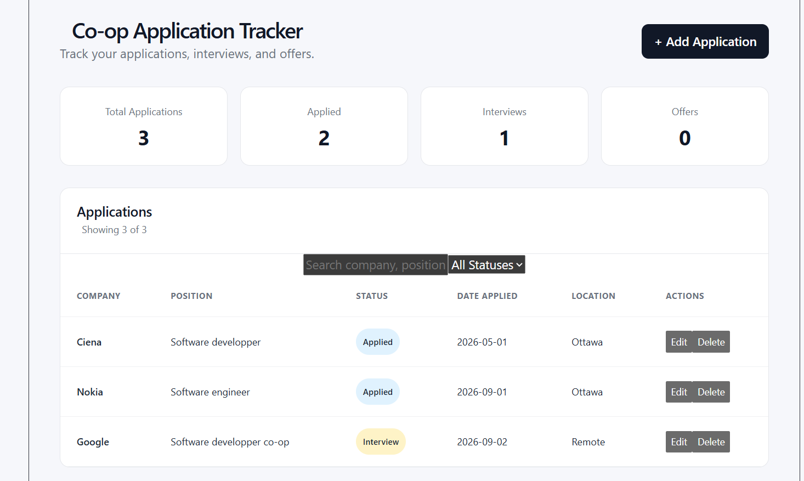

# Co-op Application Tracker

A full-stack web application for tracking co-op and internship applications throughout the job search process.

The application allows users to add, edit, delete, search, and filter job applications while tracking application statuses such as Applied, Interview, Offer, Rejected, and Withdrawn.

## Demo



## Features

- Add new job applications
- Edit existing applications
- Delete applications
- Track application status
- Search by company, position, or location
- Filter applications by status
- Dashboard statistics for applications, interviews, and offers
- Store application data persistently in PostgreSQL
- Responsive web interface

## Tech Stack

### Frontend
- React
- JavaScript
- HTML
- CSS
- Vite

### Backend
- Java
- Spring Boot
- Spring Data JPA
- REST API
- Maven

### Database
- PostgreSQL

### Tools
- Git
- GitHub
- VS Code

## Architecture

The application uses a full-stack client-server architecture:

```text
React Frontend
      |
      | HTTP / JSON
      v
Spring Boot REST API
      |
      | Spring Data JPA
      v
PostgreSQL Database
```

The React frontend sends HTTP requests to the Spring Boot REST API. Spring Boot handles the application's business logic and communicates with PostgreSQL through Spring Data JPA.

## Application Data

Each job application can contain:

- Company
- Position
- Status
- Date applied
- Application deadline
- Location
- Job posting URL
- Notes

## API Endpoints

| Method | Endpoint | Description |
|---|---|---|
| GET | `/applications` | Retrieve all applications |
| POST | `/applications` | Create an application |
| PUT | `/applications/{id}` | Update an application |
| DELETE | `/applications/{id}` | Delete an application |

## Running the Project

### Backend

A PostgreSQL database is required.

Set a `DB_PASSWORD` environment variable containing your PostgreSQL password.

Navigate to the backend:

```bash
cd coop-tracker
```

On Windows:

```bash
.\mvnw.cmd spring-boot:run
```

The backend runs on:

```text
http://localhost:8080
```

### Frontend

Navigate to the frontend:

```bash
cd frontend
```

Install dependencies:

```bash
npm install
```

Start the development server:

```bash
npm run dev
```

The frontend runs on:

```text
http://localhost:5173
```

## What I Learned

Building this project gave me experience developing a full-stack application and connecting a React frontend to a Java backend through a REST API. I also gained hands-on experience with Spring Boot, PostgreSQL, Spring Data JPA, CRUD operations, HTTP requests, database persistence, and Git version control.